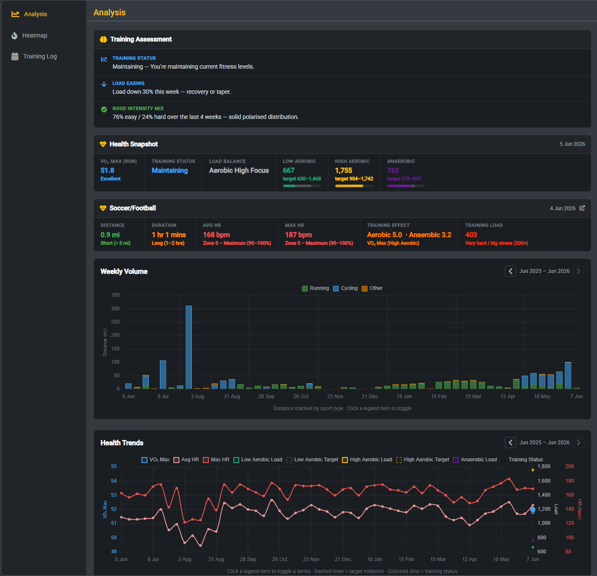
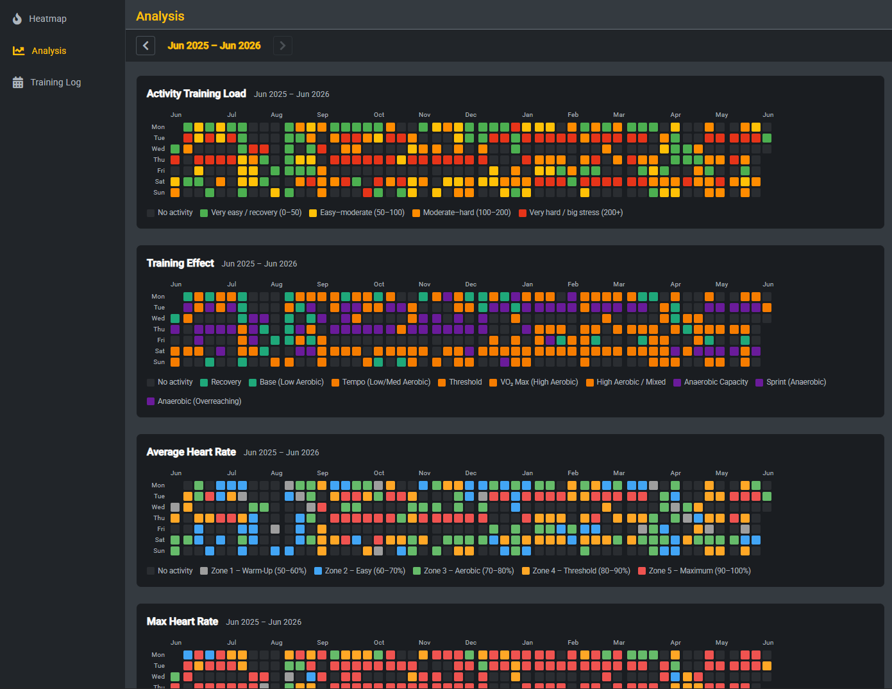
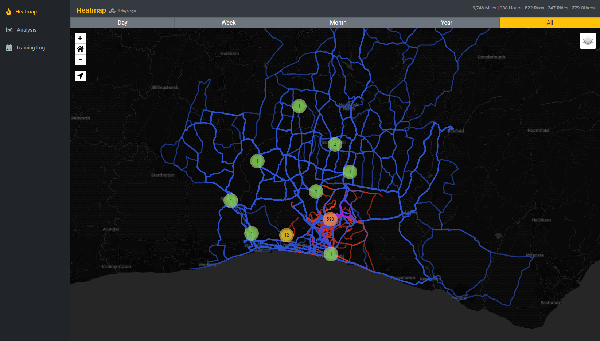
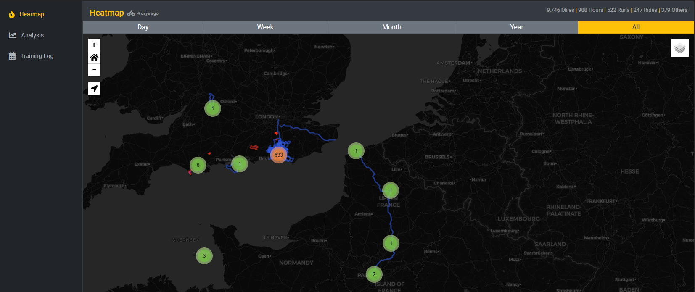
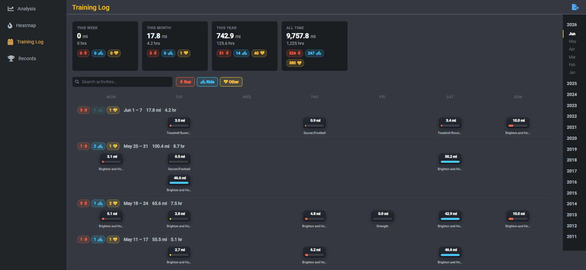

# Garmin Data Analysis

An Angular SPA backed by Python Azure Functions that pulls training and health data from **Garmin Connect** and presents it across four pages. Hosted on Azure Static Web Apps with Azure Blob Storage as the data cache — effectively free at personal-use scale.

## Pages

### Analysis

Training assessment, health snapshot, VO2 max categories, fitness and trend charts.



### Heatmap

All activities overlaid on a [Leaflet](https://leafletjs.com/) map. Routes are rendered darker the more times they have been covered. Cluster markers show the count of activities starting in each area and update automatically with zoom level. Supports multiple base map providers, activity-type filters, time filters, and detail popups.







### Training Log

Weekly activity breakdown with search/filter by name and activity type, and a detail popup for each activity.



### Compare

Compare any metric in one time period against another e.g. year vs year, month vs month.

### Personal Records

- Best times and longest efforts fetched from Garmin Connect, grouped by sport (Running, Cycling, Swimming).
- Race time predictions based on current fitness.
- Table of activities per country.

## Design Workflow

This project uses [impeccable](https://impeccable.style/) for frontend design and quality passes.

- Product intent and UX principles: [PRODUCT.md](PRODUCT.md)
- Visual system and design tokens: [DESIGN.md](DESIGN.md)

# Azure Setup

## Azure Storage Account

Create a storage account and add a container called `activities`. Inside it, the following blobs are created automatically:

```
activities/
  garmin/
    activities.json   <- created on first sync (can pre-create as [])
    tokens.json       <- created on first Garmin login
    health.json       <- created on first sync
    records.json      <- created on first sync
    sync-status.json  <- created on first sync
```

`garmin/activities.json` — all activities in a unified normalised schema.

`garmin/health.json` — time-series of daily health snapshots (VO2 max, training status, load focus). One entry is appended per day on the first successful Garmin sync of that day.

`garmin/records.json` — personal records and race predictions. Refreshed once per day during the activities sync.

`sync-status.json` - last Garmin sync time.

## Static Web App

Create a Static Web App and sign in to GitHub selecting the repo. Azure will generate the workflow file for the deployment, which:

- On PR creation: deploys to a staging environment for preview.
- On merge to master: deletes the staging deployment, builds master, and deploys to production.

# Code Settings

Angular environment settings in `src/environments/environment.ts`:

| Setting      | Description                                                          |
| ------------ | -------------------------------------------------------------------- |
| `mapCenter`  | `[lat, lng]` to centre the map on load                               |
| `userDob`    | User's date of birth (`YYYY-MM-DD`) for heart rate zone calculations |
| `userGender` | `'male'` or `'female'` for VO2 max category bands                    |

# Deployment Settings

In the Static Web App configuration (Application settings) set the following environment variables:

| Setting                        | Description                                                  |
| ------------------------------ | ------------------------------------------------------------ |
| `BLOB_CONNECTION_STRING`       | Azure Storage connection string                              |
| `BLOB_CONTAINER`               | Blob container name (default: `activities`)                  |
| `GARMIN_EMAIL`                 | Garmin Connect account email                                 |
| `GARMIN_PASSWORD`              | Garmin Connect account password                              |
| `GARMIN_SYNC_INTERVAL_MINUTES` | Minimum minutes between Garmin sync attempts (default: `15`) |

# How It Works

## Activities — `GET /api/activities`

1. Reads `garmin/sync-status.json`; if the last successful sync is newer than `GARMIN_SYNC_INTERVAL_MINUTES` (default `15`), returns cached activities without calling Garmin.
2. Otherwise loads saved Garmin OAuth tokens from `garmin/tokens.json` (or performs a fresh login if none exist).
3. Fetches new Garmin activities since the last sync and retrieves GPS route data for each, using [python-garminconnect](https://github.com/cyberjunky/python-garminconnect).
4. Reads all activities from `garmin/activities.json`, merges new ones, updates `garmin/sync-status.json`, and returns them sorted newest-first.
5. If Garmin Connect is unreachable the response still returns cached activities, with an `X-Sync-Error: true` header so the UI can show an error banner.
6. On every successful Garmin connection, also captures today's health snapshot and personal records (if not already done today).

## Health Data — `GET /api/health`

Returns the full contents of `garmin/health.json` as a JSON array, newest entries first.

This endpoint only reads blob storage; health data is refreshed as a side effect of a successful `GET /api/activities` Garmin sync.

Each entry contains:

| Field             | Description                                                                        |
| ----------------- | ---------------------------------------------------------------------------------- |
| `date`            | ISO date the snapshot was taken (`YYYY-MM-DD`)                                     |
| `vo2max_running`  | VO2 max estimate for running                                                       |
| `vo2max_cycling`  | VO2 max estimate for cycling                                                       |
| `training_status` | Garmin training status phrase (e.g. `PRODUCTIVE_1`, `MAINTAINING_2`)               |
| `load_focus`      | Monthly aerobic/anaerobic load actuals, target ranges, and a `load_balance_phrase` |

## Personal Records — `GET /api/records`

Returns the contents of `garmin/records.json`.

This endpoint only reads blob storage; records are refreshed once per day as a side effect of a successful `GET /api/activities` Garmin sync.

Contains:

| Field              | Description                                                   |
| ------------------ | ------------------------------------------------------------- |
| `date`             | ISO date the snapshot was taken                               |
| `records`          | Array of personal record objects (see below)                  |
| `race_predictions` | Predicted race times for 5K, 10K, half marathon, and marathon |

Each record object:

| Field           | Description                                             |
| --------------- | ------------------------------------------------------- |
| `type_id`       | Garmin PR type identifier                               |
| `label`         | Human-readable label (e.g. `Fastest 5K`, `Longest Run`) |
| `activity_type` | `running`, `cycling`, or `lap_swimming`                 |
| `activity_name` | Name of the activity that set the record                |
| `value`         | Seconds (timed records) or metres (distance records)    |
| `unit`          | `time` or `distance`                                    |
| `activity_id`   | Garmin Connect activity ID (for deep-link)              |
| `date`          | ISO date the record was set                             |

# Local Development

## Prerequisites

- [Azure Functions Core Tools v4](https://learn.microsoft.com/azure/azure-functions/functions-run-local) (`func` CLI)
- Python 3.11+
- Node.js / npm
- SWA CLI: `npm install -g @azure/static-web-apps-cli`

## 1. Create `api/local.settings.json`

This file is gitignored. It holds all environment variables for local runs:

```json
{
  "IsEncrypted": false,
  "Values": {
    "AzureWebJobsStorage": "UseDevelopmentStorage=true",
    "FUNCTIONS_WORKER_RUNTIME": "python",
    "BLOB_CONNECTION_STRING": "<your Azure Storage connection string>",
    "BLOB_CONTAINER": "activities",
    "GARMIN_EMAIL": "<your Garmin Connect email>",
    "GARMIN_PASSWORD": "<your Garmin Connect password>",
    "GARMIN_SYNC_INTERVAL_MINUTES": "15"
  }
}
```

Get `BLOB_CONNECTION_STRING` from your Azure Storage Account -> **Access keys** -> Connection string.

## 2. Install Python dependencies

```bash
cd api
pip install -r requirements.txt
```

## 3. Start everything

```bash
npm run dev
```

This runs the Azure Functions API, Angular dev server, and SWA proxy concurrently in one terminal.

Open **http://localhost:4280** — this routes `/api/*` to the function and everything else to the Angular dev server.

> **Note:** The SWA proxy uses `--api-devserver-url` (not `--api-location`) to connect to the already-running function. `--api-location` tells SWA CLI to start func itself, which triggers a download that fails on corporate networks with proxy certificate inspection.
