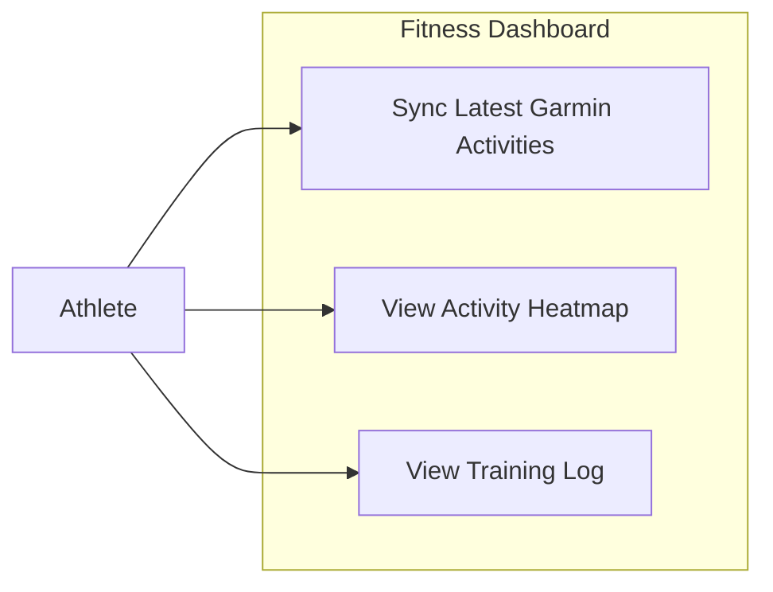
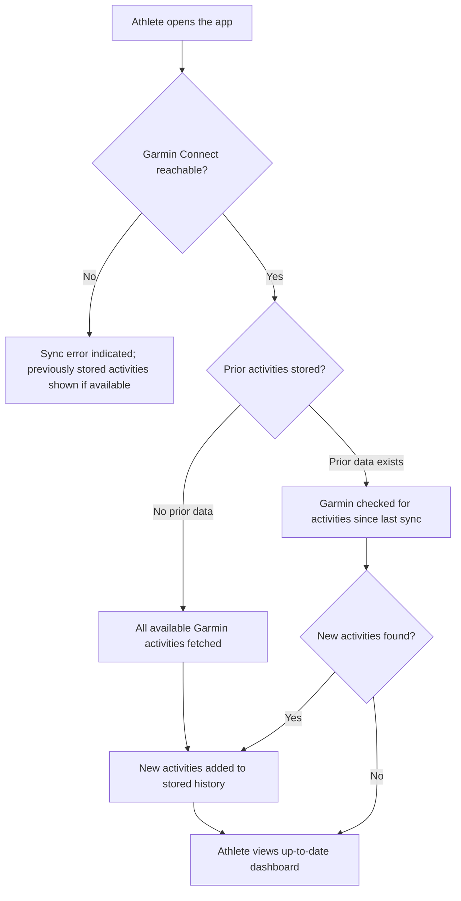
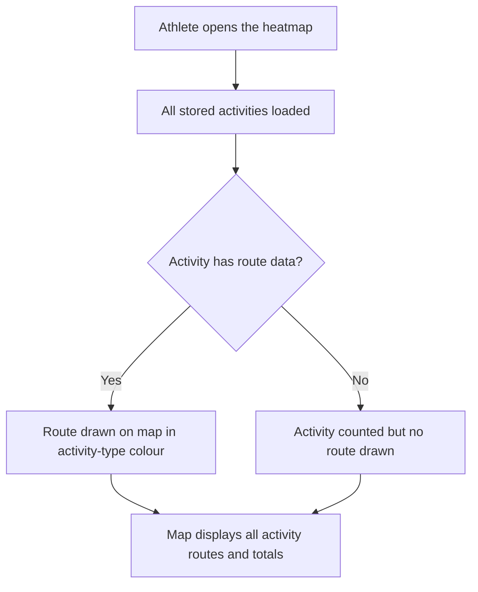
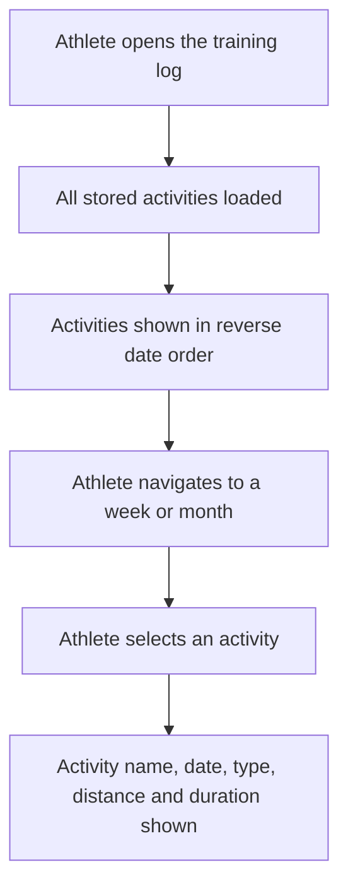

# Functional Requirements -- Garmin Connect Migration

**Feature:** Garmin Connect Migration
**Version:** 1.0
**Date:** June 3, 2026
**Status:** Draft
**Author:** ict.product-owner
**Reviewed by:** ict.product-manager

---

## 1. Overview

The fitness dashboard is an Angular web application that allows an athlete to visualise their training history through an interactive heatmap and a chronological training log. The application currently sources activity data from the Strava API. This feature migrates the data source from Strava to Garmin Connect. A unified activity schema normalises data from both sources so that previously stored Strava activities remain visible alongside new Garmin activities — giving the athlete an uninterrupted view of their complete training history without requiring any data migration or deletion of existing records.

---

## 2. Use Case Diagram

**Brief description:** Shows the athlete as the sole user of the fitness dashboard, the system boundary, and the three capabilities delivered by this feature — syncing new Garmin activities, viewing activity routes on the heatmap, and reviewing the training log.

---

## 3. Domain Object Model

| Entity               | Attribute           | Type       | Constraints                                                                                                                                              |
| -------------------- | ------------------- | ---------- | -------------------------------------------------------------------------------------------------------------------------------------------------------- |
| Activity             | id                  | Identifier | Required; unique within its source system                                                                                                                |
| Activity             | source              | Text       | Required; one of "strava" or "garmin"                                                                                                                    |
| Activity             | name                | Text       | Required, non-blank                                                                                                                                      |
| Activity             | activity_type       | Text       | Required; one of "run", "ride", "swim", "walk", "other"; any source activity type that does not map to run, ride, swim, or walk is classified as "other" |
| Activity             | start_date          | Timestamp  | Required; UTC, ISO 8601 format                                                                                                                           |
| Activity             | distance_meters     | Decimal    | Required; ≥ 0                                                                                                                                            |
| Activity             | moving_time_seconds | Decimal    | Required; ≥ 0                                                                                                                                            |
| Activity             | encoded_route       | Text       | Optional; encoded GPS polyline; null if GPS track not available for the activity                                                                         |
| Activity             | start_latitude      | Decimal    | Optional; WGS84 latitude in range −90 to 90; null if GPS unavailable                                                                                     |
| Activity             | start_longitude     | Decimal    | Optional; WGS84 longitude in range −180 to 180; null if GPS unavailable                                                                                  |
| Garmin Session Token | access_token        | Text       | System-assigned; required to call Garmin Connect on behalf of the athlete                                                                                |
| Garmin Session Token | refresh_token       | Text       | System-assigned; used to renew the access token without re-entering credentials                                                                          |
| Garmin Session Token | expires_at          | Timestamp  | System-assigned; UTC timestamp when the access token expires                                                                                             |

**Note on Garmin Session Token provisioning:** The athlete's Garmin Connect credentials are pre-configured in the system environment. On first connection, the system authenticates using those credentials and stores the resulting session tokens automatically. No user interaction is required for authentication or token renewal on subsequent opens.

---

## 4. User Stories

### US-1: As an athlete, I want my latest Garmin activities to be fetched when I open the app, so that my heatmap and training log always reflect my recent training

**Dependencies:** None

**Activity Diagram:**

**Acceptance Criteria:**

- Given no activities have been previously synced, when the athlete opens the app, then all available Garmin activities are retrieved and available in the dashboard
- Given activities have been previously synced, when the athlete opens the app, then any Garmin activities not already present in the dashboard appear alongside existing activities, and no previously synced activity is duplicated
- Given Garmin Connect is unreachable when the athlete opens the app, then the athlete is shown an error indication that the sync failed; any previously stored activities remain visible, and if no activities have been previously stored the dashboard displays an empty state alongside the error

---

### US-2: As an athlete, I want to view all my activities on the heatmap regardless of whether they came from Garmin or Strava, so that I can see my complete training routes

**Dependencies:** US-1

**Activity Diagram:**

**Acceptance Criteria:**

- Given Garmin activities with GPS route data have been synced, when the athlete views the heatmap, then Garmin activity routes appear as coloured lines on the map using the same colour scheme as the existing activity types
- Given historical Strava activities exist in storage, when the athlete views the heatmap, then their routes appear alongside Garmin activity routes with no visible distinction between sources
- Given an activity from either source has no GPS route data, when the heatmap is displayed, then that activity is included in the activity count totals but no route line is drawn for it

---

### US-3: As an athlete, I want the training log to display all my activities with consistent details regardless of source, so that I can review my complete training history

**Dependencies:** US-1

**Activity Diagram:**

**Acceptance Criteria:**

- Given activities from both Strava and Garmin exist in storage, when the athlete views the training log, then all activities are displayed in reverse-chronological order with name, date, activity type, distance, and moving time shown for each
- Given a Garmin activity has been normalised to activity type "run" or "ride", when it is displayed in the training log, then the athlete sees a human-readable type label (e.g. "Run", "Ride") consistent with the labels used for Strava activities of the same type
- Given a historical Strava activity is displayed in the training log, when the athlete views it, then it shows the same fields as a Garmin activity with no indication that it originated from a different source

---

## 5. Out of Scope

- Multi-Factor Authentication (MFA) for Garmin Connect — the athlete's account does not use MFA and support for it will not be built
- One-time migration or format conversion of existing Strava activity blobs — existing Strava activities are preserved as-is and are not deleted, converted, or modified
- Scheduled or background activity sync — activities are only synced when the athlete opens the app
- Multi-athlete or multi-user support — the application serves a single athlete
- Strava API integration — it is fully removed and will not be available as a fallback
- Manual force-sync or refresh capability from the UI
- Deletion, editing, or manual upload of activities
- OAuth-based in-browser login for the athlete to authenticate with Garmin Connect
- Display of Garmin health metrics (heart rate, sleep, stress, body composition, etc.) beyond activity records
- Backfilling GPS route data for historical Garmin activities that were recorded without GPS
- Re-syncing or updating Garmin activities that were previously synced but subsequently edited in Garmin Connect — only activities not already present are added; existing activity records are never modified
