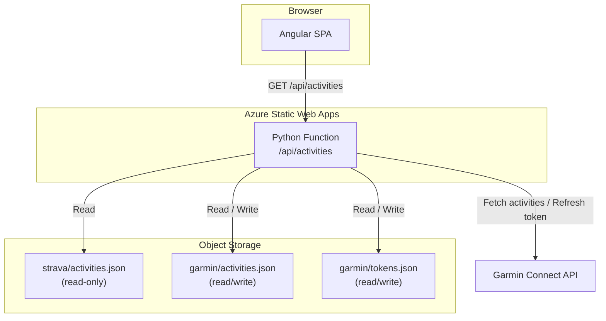
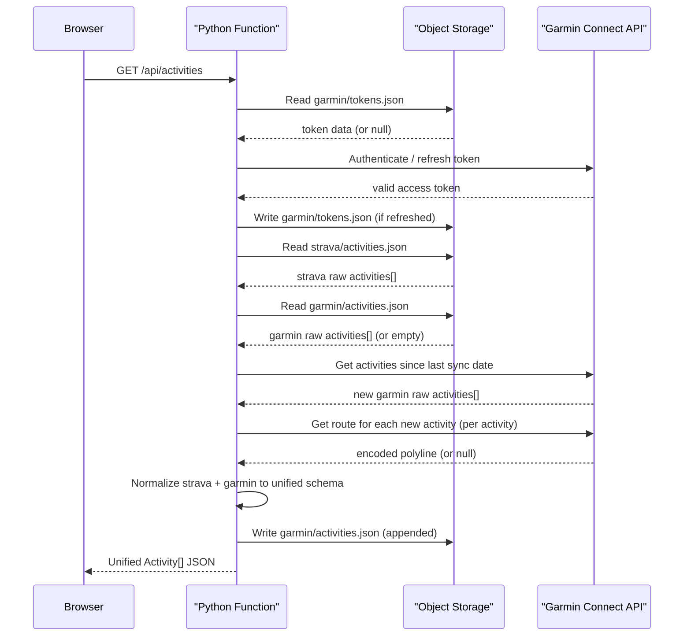
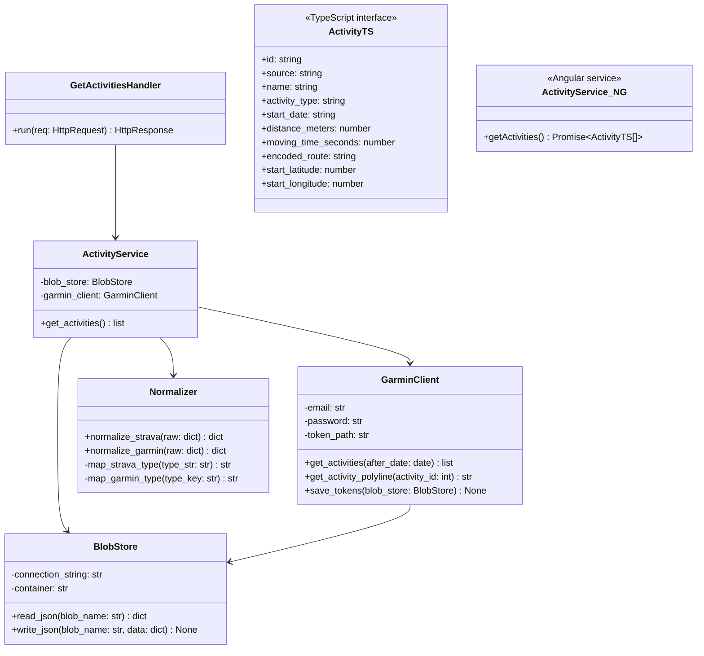
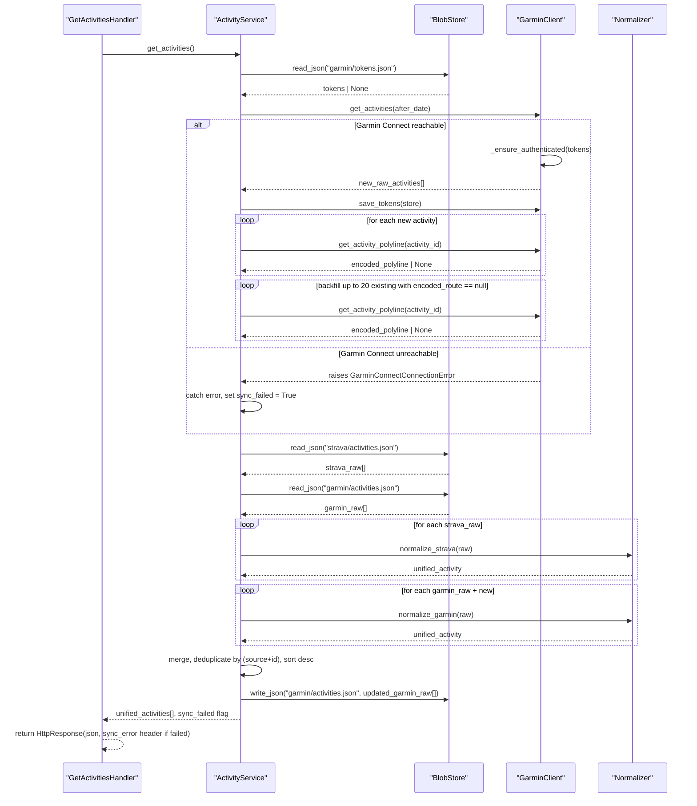

# Technical Implementation Plan -- Garmin Connect Migration

**Feature:** Garmin Connect Migration
**Version:** 1.0
**Date:** June 3, 2026
**Status:** Draft
**Author:** ict.technical-lead
**Based on:** `docs/specifications/garmin-connect-migration/spec.md`
**Research:** `docs/specifications/garmin-connect-migration/research.md`

---

## 1. Technical Context and Constraints

### 1.1 Technology Stack

| Layer | Choice | Version |
|-------|--------|---------|
| Frontend framework | Angular | 17+ (TypeScript) |
| Frontend language | TypeScript | 5.x |
| Backend runtime | Python | 3.11 |
| Backend framework | Azure Functions | v2 programming model (decorator-based) |
| Backend host | Azure Functions runtime | 4.x |
| Garmin library | python-garminconnect | ~0.3.4 |
| HTTP client (Garmin lib dep) | curl\_cffi | latest compatible |
| Blob SDK | azure-storage-blob | latest stable |
| Polyline encoding | polyline | ~2.0 |
| GPX parsing | lxml or xml.etree.ElementTree | stdlib / lxml |
| Hosting | Azure Static Web Apps | Standard tier (Python 3.11 `platform.apiRuntime`) |
| Object storage | Azure Blob Storage | (via connection string env var) |

### 1.2 Constraints

- **Blob preservation**: `strava/activities.json` must never be modified or deleted; it is treated as immutable read-only storage of historical Strava activity data.
- **Endpoint contract**: The `/api/activities` HTTP route must remain unchanged; the Angular frontend calls this URL directly.
- **API folder location**: Azure Static Web Apps requires the backend to reside in `api/`; all Python function files go there.
- **No additional persistence layer**: Azure Blob Storage is the sole persistence mechanism; no database, queue, or cache may be introduced.
- **Single athlete**: The system serves exactly one athlete; no multi-tenancy, session management, or user authentication is in scope.
- **No MFA**: The Garmin account does not use MFA; the authentication flow is credential-only.
- **SWA 45-second request limit**: The Azure Static Web Apps managed API enforces a 45-second maximum request duration. This constrains how many per-activity `get_activity_details` calls can be made in a single function invocation; the polyline backfill strategy must respect this limit.
- **SWA HTTP-only trigger**: The SWA managed API supports only HTTP-triggered functions; no timer, queue, or background triggers are available in this hosting model.
- **`staticwebapp.config.json` update required**: The `platform.apiRuntime` key must be set to `python:3.11` so Azure Static Web Apps knows to use the Python runtime for the `api/` folder.
- **Strava removal**: The Strava API integration is removed entirely; no Strava OAuth, token refresh, or API calls remain after this change.
- **Activity updates not synced**: Garmin activities already present in storage are never re-fetched or overwritten; the sync is additive-only.

---

## 2. Solution Architecture

### Diagram 1: System Architecture

**Brief description:** Shows the major system layers, the two external systems (Garmin Connect and Object Storage), and how the Angular SPA and Python API relate to each other within the Azure Static Web Apps hosting boundary.

### Diagram 2: Integration and Data Flow

**Brief description:** Shows the end-to-end request flow from the browser through the Python function, detailing how Garmin authentication, activity sync, normalization, and blob persistence are sequenced on each app open.

---

## 3. Software Architecture

### Diagram 3: Component and Class Structure

**Brief description:** Shows the Python backend module structure with class and function responsibilities, and the Angular frontend types and service that replace the existing Strava-specific code.

### Diagram 4: Interaction and Flow

**Brief description:** Shows the detailed method-level call sequence for the incremental sync path (prior activities exist), including authentication check, new-activity fetch, per-activity polyline retrieval, normalization, and storage update.

## 4. Architecture Decisions

| Decision | Choice | Rationale |
|----------|--------|-----------|
| Polyline backfill strategy | Incremental amortisation across opens | The SWA managed API enforces a 45-second request limit. Fetching `get_activity_details` for all activities in one request is impractical for an initial sync of hundreds of activities. Strategy: on each function invocation, fetch polylines only for new activities from the incremental sync, then backfill up to 20 historical Garmin activities where `encoded_route` is null. This amortises the initial cost across multiple app opens without exceeding the timeout. |
| GPS route extraction — primary path | `get_activity_details(activity_id, maxpoly=4000)` | Research confirms this endpoint supports a `maxPolylineSize` parameter. The exact response field path for the polyline array is not confirmed; `GarminClient.get_activity_polyline()` must inspect the response dynamically and encode found lat/lng points using the `polyline` library. |
| GPS route extraction — fallback path | `download_activity(activity_id, DownloadFormat.GPX)` + parse GPX trackpoints | If the details response contains no usable route geometry, the GPX download provides a reliable fallback. GPX trackpoints are parsed using the stdlib `xml.etree.ElementTree` to avoid extra dependencies. |
| Garmin activities storage format | Enriched raw: raw Garmin activity dict with `encoded_route` field appended | Storing the raw Garmin response plus the computed `encoded_route` keeps the original data intact (in case normalization logic changes) and allows the backfill strategy to query `encoded_route == null` without a separate index. |
| `proxies.json` deletion | Delete `api/proxies.json` | Research confirms it is a legacy Azure Functions feature (v1–v3) not used in the current SWA managed API routing. Retaining it serves no purpose and would be confusing in a Python v2 function app. |
| `staticwebapp.config.json` platform config | Add `"platform": { "apiRuntime": "python:3.11" }` | Required so Azure Static Web Apps selects the Python 3.11 runtime for the `api/` folder. Without this, SWA defaults to detecting the runtime from the existing Node.js `package.json`. |
| Backend language | Python 3.11 | Required by specification; enables use of `python-garminconnect` library |
| Azure Functions programming model | v2 (decorator-based) | Current recommended model for Python; eliminates `function.json` per-function files; requires Functions runtime 4.x |
| Blob SDK usage over blob bindings | Direct `azure-storage-blob` SDK | The function reads two input blobs and writes two output blobs conditionally; blob bindings require all bindings to be declared upfront and cannot be conditional, making the SDK the more practical choice |
| Separate blobs for Strava and Garmin activities | `strava/activities.json` (read-only) + `garmin/activities.json` (read/write) | Preserves the immutability constraint on Strava data; clear audit boundary; allows the last-sync date to be derived solely from the Garmin blob without scanning Strava records |
| Normalization on read | Strava and Garmin raw formats stored as-is; normalization happens in `Normalizer` at request time | Keeps historical data untouched; single source of truth per format; no destructive transform of existing blobs |
| Deduplication key | `source` + `id` combination | Garmin IDs are unique within Garmin; Strava IDs within Strava; combining with source prevents cross-source collisions |
| Activity type mapping | Closed enum: `run`, `ride`, `swim`, `walk`, `other` | Matches the unified domain model; Garmin type keys (`running`, `trail_running`, etc.) and Strava types (`Run`, `VirtualRide`, etc.) are mapped at normalisation time; unmapped types fall to `other` |
| Angular service rename | `strava.service.ts` → `activity.service.ts`, class `StravaService` → `ActivityService` | Removes Strava branding; aligns with source-agnostic design |
| Unified `Activity` TypeScript interface | Replace `class Activity` + `class Map` with a flat `interface Activity` matching the Python unified schema | Removes nested `map.summary_polyline`; flat structure matches API response directly; `encoded_route` replaces `map.summary_polyline` |

---

## 5. Integration Points and Dependencies

| Dependency | Type | Purpose |
|------------|------|---------|
| Garmin Connect API | External HTTP API | Source of activity data and authentication; accessed via `python-garminconnect` |
| `python-garminconnect` ~0.3.4 | Python pip package | Wraps Garmin Connect REST API; handles SSO authentication and token refresh |
| `curl_cffi` | Python pip package | Required HTTP transport dependency of `python-garminconnect`; must be listed in `requirements.txt` |
| `azure-storage-blob` | Python pip package | Reads and writes JSON blobs for token storage and activity persistence |
| `polyline` ~2.0 | Python pip package | Encodes arrays of GPS lat/lng coordinates into the Google Encoded Polyline format expected by the Angular Leaflet heatmap |
| Azure Blob Storage | Cloud service | Persists Garmin tokens and activities; Strava activities already stored here |
| Azure Static Web Apps | Hosting platform | Hosts the Angular SPA and Python API; determines runtime support and API folder conventions |

---

## 6. Research Findings

| Finding | Source | Applies to |
|---------|--------|------------|
| Garmin activity list confirmed fields: `activityId`, `activityName`, `startTimeLocal`, `startTimeGMT`, `activityType.typeKey`, `duration`, `movingDuration`, `distance` | `garminconnect/typed.py`, `tests/test_typed.py` | Section 3 Normalizer, Section 7 EN-4 |
| Start lat/lng field names in activity list payload are **not confirmed** from library typed models; treat as runtime-discovered | Absence in `typed.py` typed models | Section 3 GarminClient, Section 8 |
| Encoded polyline is **not available** in the activity list response; route geometry requires `get_activity_details(activity_id, maxpoly=4000)` | `garminconnect/__init__.py`, PR #313 | Section 4 polyline decision, Section 3 GarminClient |
| Exact JSON field path for polyline array in details response is **not confirmed**; implementation must discover dynamically | `garminconnect/__init__.py`, lack of typed model coverage | Section 3 GarminClient, Section 8 |
| GPX download (`download_activity(id, DownloadFormat.GPX)`) provides a reliable fallback for route data | `garminconnect/__init__.py` | Section 4 fallback decision |
| No official numeric Garmin API rate limits published; `GarminConnectTooManyRequestsError` (429) is mapped as fail-fast | `garminconnect/__init__.py`, issues #337, #213 | Section 4 backoff strategy, Section 8 |
| Token reuse is the primary mitigation for rate limit / auth lockout risk; avoid fresh login per invocation | Maintainer guidance in issues #213, #337, PR #353 | Section 4 token storage decision |
| Azure Static Web Apps managed API supports `python:3.11` via `platform.apiRuntime` in `staticwebapp.config.json` | [SWA configuration docs](https://learn.microsoft.com/en-us/azure/static-web-apps/configuration#platform) | Section 1 stack, Section 4 SWA config decision |
| SWA managed API enforces 45-second maximum request duration and HTTP-only triggers | [SWA APIs overview](https://learn.microsoft.com/en-us/azure/static-web-apps/apis-overview) | Section 4 backfill strategy decision, Section 1 constraints |
| `proxies.json` is a legacy Azure Functions v1–v3 feature; not required in a Python v2 function app on SWA | [Azure Functions Proxies docs](https://learn.microsoft.com/en-us/azure/azure-functions/functions-proxies) | Section 4 proxies.json decision, Section 7 EN-1 |

---

## 7. Technical Leadership

### 7.1 Foundation Enablers

#### EN-1: As a developer, I want the `api/` folder replaced with a Python Azure Functions v2 scaffold, so that all backend stories can be developed and deployed

**Acceptance Criteria:**
- Given the existing Node.js `api/` folder, when EN-1 is complete, then `api/` contains `function_app.py`, `requirements.txt`, and an updated `host.json` using extension bundle `[4.0.0, 5.0.0)`, and the Node.js files (`index.js`, `package.json`, `HttpTrigger/function.json`, `proxies.json`) are removed
- Given the scaffold is deployed to Azure Static Web Apps, when a GET request is made to `/api/activities`, then the Python function handles the request and returns a 200 response
- Given `staticwebapp.config.json` in the workspace root, when EN-1 is complete, then it contains `"platform": { "apiRuntime": "python:3.11" }` so Azure Static Web Apps selects the Python runtime

**Prerequisite for:** EN-2, EN-3, EN-4, US-1

---

### 7.2 Story-Level Enablers

#### EN-2: As a developer, I want a `BlobStore` service that reads and writes JSON to Azure Blob Storage, so that all functions can access activity and token data without duplicating blob SDK calls

**Acceptance Criteria:**
- Given a valid `BLOB_CONNECTION_STRING` environment variable, when `BlobStore.read_json(blob_name)` is called for an existing blob, then the parsed JSON content is returned
- Given a valid `BLOB_CONNECTION_STRING`, when `BlobStore.read_json(blob_name)` is called for a non-existent blob, then `None` is returned without raising an exception
- Given a valid `BLOB_CONNECTION_STRING`, when `BlobStore.write_json(blob_name, data)` is called, then the blob is created or overwritten with the serialised JSON

**Prerequisite for:** EN-3, US-1

#### EN-3: As a developer, I want a `GarminClient` that authenticates with Garmin Connect and stores tokens in blob storage, so that the function can fetch activities without interactive login

**Acceptance Criteria:**
- Given `GARMIN_EMAIL` and `GARMIN_PASSWORD` environment variables are set and no token blob exists, when `GarminClient` is initialised and `get_activities()` is called, then the client authenticates via Garmin SSO, stores the resulting tokens to `garmin/tokens.json`, and returns a list of activities
- Given a valid token blob exists in `garmin/tokens.json`, when `get_activities()` is called, then the client restores the token without re-entering credentials and auto-refreshes if expired
- Given Garmin Connect is unreachable, when `get_activities()` is called, then a `GarminConnectConnectionError` is raised and propagates to the caller

**Prerequisite for:** US-1

#### EN-4: As a developer, I want `Normalizer` functions that convert raw Strava and Garmin activity dicts to the unified `Activity` schema, so that the function can return a consistent response regardless of source

**Acceptance Criteria:**
- Given a raw Strava activity dict, when `normalize_strava(raw)` is called, then the returned dict contains `id`, `source` = `"strava"`, `name`, `activity_type` (mapped from Strava `type`), `start_date`, `distance_meters`, `moving_time_seconds`, `encoded_route` (from `map.summary_polyline`, or `null`), `start_latitude`, and `start_longitude`
- Given a raw Garmin activity dict, when `normalize_garmin(raw)` is called, then the returned dict contains the same fields with `source` = `"garmin"` and values mapped from Garmin field names
- Given a Strava or Garmin activity type string that does not map to `run`, `ride`, `swim`, or `walk`, when the normalizer processes it, then `activity_type` is set to `"other"`

**Prerequisite for:** US-1, US-2, US-3

#### EN-5: As a developer, I want the Angular `Activity` interface and `ActivityService` updated to the unified schema, so that the frontend components can render Garmin and Strava activities with the same code

**Acceptance Criteria:**
- Given the existing `Activity` class in `src/app/types/Activity.ts`, when EN-5 is complete, then it is replaced with a flat TypeScript `interface Activity` containing `id: string`, `source: string`, `activity_type: string`, `start_date: string`, `distance_meters: number`, `moving_time_seconds: number`, `encoded_route: string | null`, `start_latitude: number | null`, and `start_longitude: number | null`
- Given the existing `strava.service.ts`, when EN-5 is complete, then it is renamed `activity.service.ts` and the class is renamed `ActivityService`; all component imports are updated
- Given `Map.ts` is used solely to type `Activity.map`, when EN-5 is complete, then `Map.ts` is deleted and its import removed from `Activity.ts`

**Prerequisite for:** US-2, US-3

---

### 7.3 Story-to-Component Mapping

| Story | Components Touched | Notes |
|-------|--------------------|-------|
| EN-1 | `api/function_app.py`, `api/host.json`, `api/requirements.txt`, `staticwebapp.config.json` | Removes: `api/HttpTrigger/index.js`, `api/HttpTrigger/function.json`, `api/package.json`, `api/proxies.json`; adds `platform.apiRuntime` to `staticwebapp.config.json` |
| EN-2 | `api/blob_store.py` | Depends on EN-1 |
| EN-3 | `api/garmin_client.py` | Depends on EN-1; reads/writes via `BlobStore` |
| EN-4 | `api/normalizer.py` | Depends on EN-1; pure functions, no I/O |
| EN-5 | `src/app/types/Activity.ts`, `src/app/activity.service.ts`, `src/app/heatmap/heatmap.component.ts`, `src/app/training-log/training-log.component.ts` | Frontend-only; can run in parallel with EN-1 through EN-4 |
| US-1 | `api/activity_service.py`, `api/function_app.py` (handler wired), `src/app/activity.service.ts` | Depends on EN-1 through EN-4; delivers the working `/api/activities` endpoint; `ActivityService` in Angular handles the sync error response and passes error state to components |
| US-2 | `src/app/heatmap/heatmap.component.ts` | Depends on US-1 and EN-5; field references updated: `activity.map.summary_polyline` → `activity.encoded_route`, `activity.type` → `activity.activity_type`, `activity.distance` → `activity.distance_meters`, `activity.moving_time` → `activity.moving_time_seconds`, `activity.start_latlng` → `[activity.start_latitude, activity.start_longitude]` |
| US-3 | `src/app/training-log/training-log.component.ts` | Depends on US-1 and EN-5; same field reference updates as US-2 |

---

## 8. Open Questions and Risks

| Item | Type | Impact | Status |
|------|------|--------|--------|
| Start lat/lng field names in the Garmin activity list response are not confirmed from `python-garminconnect` typed models; implementation must discover at runtime (likely `startLatitude` / `startLongitude` based on Garmin API conventions) | Risk | If field names differ, `start_latitude` and `start_longitude` will be null for all Garmin activities | Open |
| Exact JSON field path for polyline array in `get_activity_details` response is not confirmed; `GarminClient.get_activity_polyline()` must inspect the response dynamically and fall back to GPX parsing if absent | Risk | Affects reliability of primary polyline extraction path; mitigated by confirmed GPX fallback | Open |
| No official Garmin Connect API rate limits published; a large initial backlog could trigger 429 responses during backfill polyline fetches | Risk | If 429 responses are frequent, polyline backfill will be slow across many app opens; mitigated by amortised-per-open strategy and token reuse | Open |
